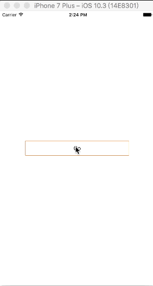

# CCSpringUpNavController
[](https://developer.apple.com/iphone/index.action)
[](http://mit-license.org)

## Description
*CCSpringUpNavController* is a pop-up view, the type is a NavigationController,through create a new controller as the CCPopUpNavController's rootviewcontroller can be easily placed in which you want the view or control, easier to achieve the desired effect

However if you're using Swift in your project, I recommend using [CCPopUpNavController](https://github.com/jsaddnf/CCPopUpNavController)

## ScreenShot



## Install

Copy the source code in you project

## Useage

### You must set the CCSpringUpNavController.view.frame. the height is the pop view's visible height

```objectivec
CCSpringUpNavController *ccnav = [[CCSpringUpNavController alloc]initWithRootViewController:[[ShowUpViewController alloc]init]];
    //should set CCSpringUpNavController.view.frame
ccnav.view.frame = CGRectMake(0, 0, [UIScreen mainScreen].bounds.size.width, 400);
    // set optionalValues
//    ccnav.tapDismissEnabled = YES;
//    ccnav.annimationDuration = 0.35f;
//    ccnav.backgroundShadeColor = [UIColor blackColor];
//    ccnav.scaleTransform = CGAffineTransformMakeScale(.94, .94);
//    ccnav.springDamping = 0.88;
//    ccnav.springVelocity = 14;
//    ccnav.backgroundShadeAlpha = 0.4;
[self presentViewController:ccnav animated:YES completion:nil];
```

## License

CCSpringUpNavController is available under the MIT license. See the LICENSE file for more info.
